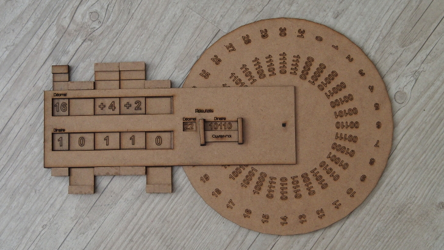
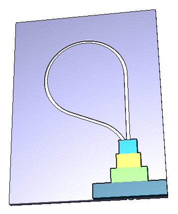

# Exporoute

Activités pour l'exporoute &mdash; exposition itinérante autour du numérique et en particulier de la science informatique &mdash; organisée par [Inria Nancy Grand-Est](http://www.inria.fr/centre/nancy) et la [MJC Nomade](http://mjc-nomade.fr/)

## Activités

* [Nombres Binaires](./binaire/) (Information)
* [Crépier psychorigide](./crepier/) (Algorithme)
* ?? (Langage)
* [Portes Logiques](./portes-logiques/) (Machine)

## Bibliographie / Inspiration

* bilanCSUnplugged (pièce jointe de la dernière fois)
* Computer Science Unplugged http://csunplugged.org/books/
* Sciences Manuelles du Numérique http://wiki.nybi.cc/index.php/CSIRL et https://pixees.fr/?p=3159
* http://img.over-blog-kiwi.com/0/93/68/14/20140724/ob_924deb_le-vaisseau-strasbourg-enfants-blogs-m.JPG
* Une machine d'Hollerith https://interstices.info/upload/outils-machine-informatique/hollerith-1.jpg mais elle originale
* machines de turing https://interstices.info/applet-machine-turing https://interstices.info/machine-turing-interactive en ligne ou en … lego http://www.ens-lyon.eu/actualites/la-machine-de-turing-en-legos--158118.kjsp?RH=ENS-LYON-FR-evenemen
* http://castor-informatique.fr/
* http://expocastor.gforge.inria.fr/ qui sont les exercices du précédent mais classifiés selon le thème
* http://lrf-blog.com/2014/12/21/logibox/
* http://logibox.gaelgouault.com/
* http://kylem.net/hardware/hardware.html
* http://web.mit.edu/kmill/www/hardware/cardiac/CARDIAC_manual.pdf
* http://nguyen.univ-tln.fr/ordinapoche.html

## Licence
Travaux sous licence [CC BY-SA 3.0 FR](https://creativecommons.org/licenses/by-sa/3.0/fr/) par [Nybi.cc](https://github.com/NYBI) sur une commande de l'[Inria Nancy Grand-Est](http://www.inria.fr/centre/nancy) et la [MJC Nomade](http://mjc-nomade.fr/).