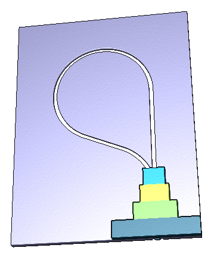
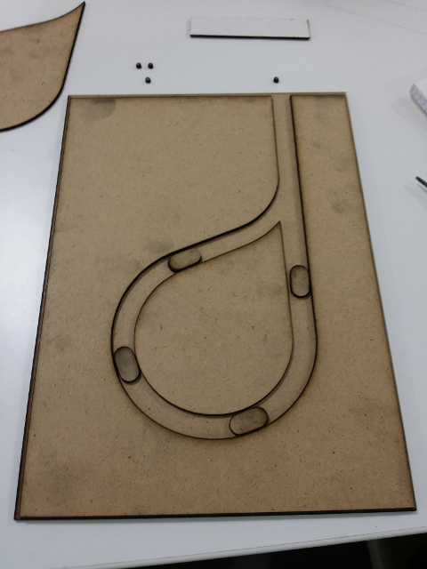
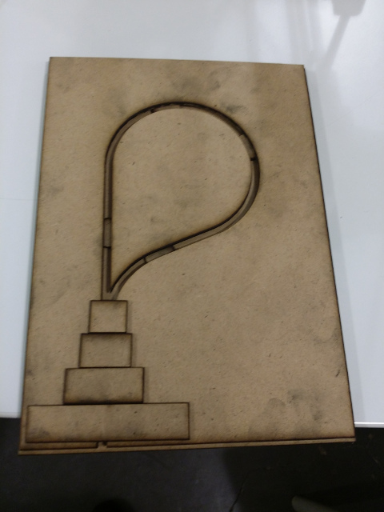

# Crépier psychorigide (Algorithme)

Activité pour découvrir la notion d'algorithme.
Cette activité fait partie de l'[exporoute](https://github.com/NYBI/exporoute).

## Licence
Design par [Loïc Fejoz](https://github.com/loic-fejoz/) pour [Nybi.cc](https://github.com/NYBI).
Travaux sous licence [CC BY-SA 3.0 FR](https://creativecommons.org/licenses/by-sa/3.0/fr/)