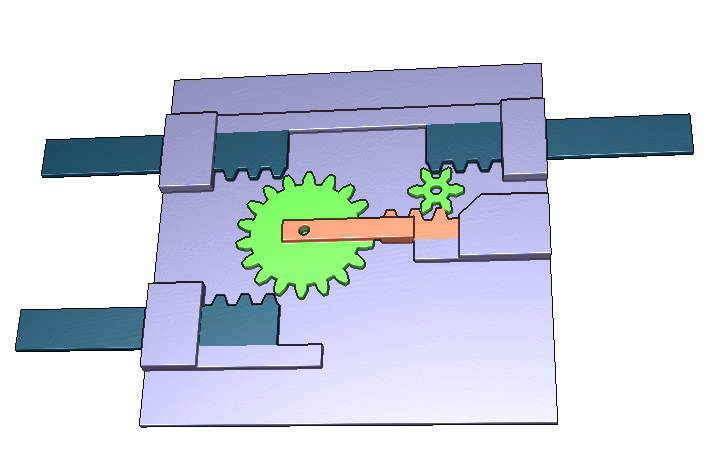

# Portes Logiques (Machine)

Activité pour découvrir la notion de machine.
Cette activité fait partie de l'[exporoute](https://github.com/NYBI/exporoute).

## Objectifs

Construire les portes logiques Ou, Non, Et, NOR, XOR, etc à partir de la porte logique NAND.

## Fabrication

* [Découper](activite-machine-decoupe.svg)
* Monter
* Ajouter un ressort de rappel

## Licence
Design par [Loïc Fejoz](https://github.com/loic-fejoz/) pour [Nybi.cc](https://github.com/NYBI).
Travaux sous licence [CC BY-SA 3.0 FR](https://creativecommons.org/licenses/by-sa/3.0/fr/)